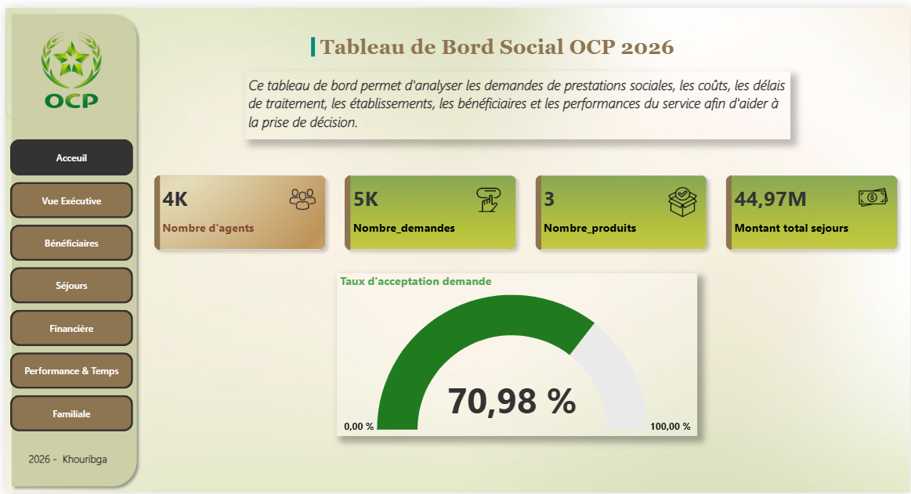
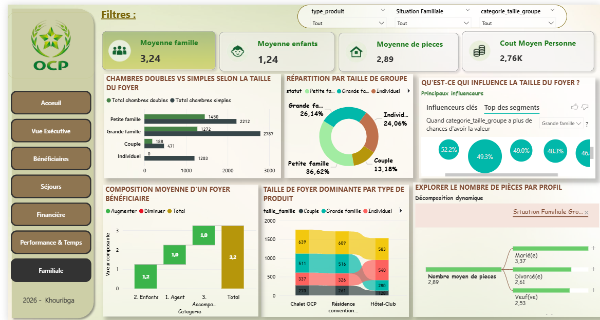
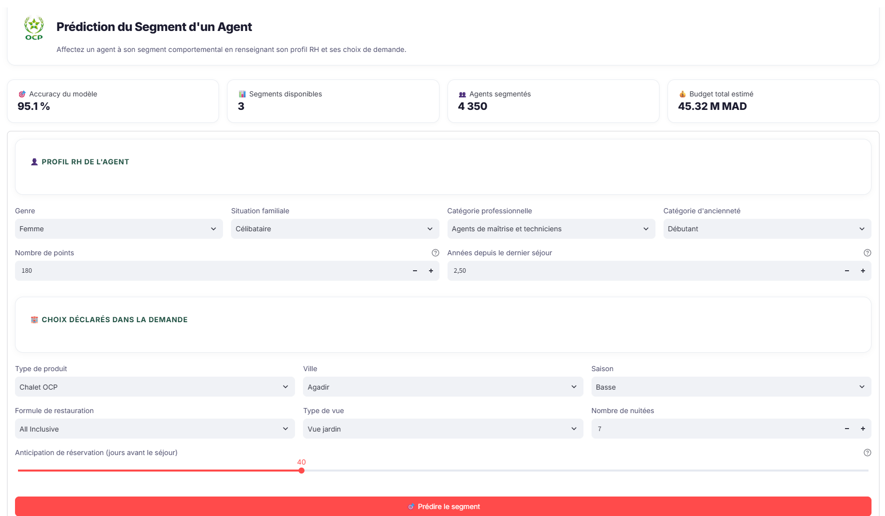

# OCP Social Analytics | Business Intelligence & Machine Learning

**Academic PFA Project · ENSA Khouribga · 2025–2026**

An end-to-end data analytics project developed in the context of the OCP Group's Social Service (Khouribga site). The project combines **data preparation, SQL Server data warehousing, Power BI reporting, behavioral segmentation, and a Streamlit application** to support analysis of social-benefit and summer-stay applications.

> Academic case study — not an official OCP software product.

## Project Objectives

- Audit, clean, and enrich operational data using Python.
- Design a **star-schema data warehouse** in Microsoft SQL Server.
- Create a **seven-page Power BI dashboard** for operational and financial reporting.
- Identify beneficiary profiles using **K-Prototypes clustering**.
- Develop a model for **assigning agents to existing behavioral segments**, with a Streamlit interface.

## Key Results

| Indicator | Result |
| --- | --- |
| Data analyzed | 5,000 applications, 44 original fields (2026 campaign) |
| Agents included in segmentation | 4,350 |
| Data warehouse | 1 fact table and 4 dimensions |
| Power BI | 7 dashboard pages, about 30 DAX measures |
| Behavioral segmentation | 3 K-Prototypes clusters |
| Segment-assignment model | 95.06% test accuracy |
| Demographic-only validation | 46.32% accuracy vs. 41.49% majority-class baseline |

**Interpretation:** The 95.06% accuracy measures how well a classifier assigns agents to segments established from behavioral variables. It is **not evidence of accurate future-behavior prediction** for agents without behavioral history.

## Technical Architecture

```text
Operational Excel data (not published)
                |
                v
    Python: audit, cleaning, enrichment
                |
          +-----+-----------------------+
          |                             |
          v                             v
     SQL Server DW               Agent-level aggregation
     (star schema)                        |
          |                               v
          v                       K-Prototypes (K = 3)
     Power BI                           |
     (7 pages)                          v
                               Logistic Regression
                               (segment assignment)
                                        |
                                        v
                                  Streamlit app
```

The star schema contains `Fait_Demandes` (one row per application), `Dim_Agent`, `Dim_Etablissement`, `Dim_Periode`, and `Dim_Temps`.

## Technology Stack

| Domain | Technologies |
| --- | --- |
| Data Engineering | Python, Pandas, Jupyter Notebook |
| Data Warehouse | Microsoft SQL Server, SQL |
| Business Intelligence | Power BI Desktop, DAX |
| Segmentation | K-Prototypes, clustering evaluation |
| Classification | Logistic Regression, scikit-learn |
| User Interface | Streamlit |

## Repository Structure

```text
.
├── dashboards/                   # Power BI dashboard screenshots
├── notebooks/
│   ├── nettoyage.ipynb
│   ├── enrichissement.ipynb
│   └── Machine Learning segmentation.ipynb
├── sql/
│   └── sql_creation_dimension_fait_.sql
├── streamlit_app/
│   ├── app.py
│   ├── form_options.json
│   ├── metrics.json
│   ├── install.txt
│   └── screenshots/             # Streamlit interface screenshots
├── .gitignore
└── README.md
```

## Power BI Dashboard Gallery

Seven analytical pages cover executive monitoring, beneficiaries, stays, financial indicators, time-based performance, and family-related insights.

| Home | Executive Overview |
| --- | --- |
|  |  |

| Beneficiaries | Stays |
| --- | --- |
|  |  |

| Financial Analysis | Performance & Time |
| --- | --- |
|  |  |

**Family Analysis**



The original Power BI `.pbix` file is not included in this repository.

## Behavioral Segmentation and Evaluation

The analytical pipeline aggregates data at the agent level and uses 15 behavioral variables for clustering.

| Cluster | Agents | Share |
| --- | ---: | ---: |
| Segment 0 | 1,195 | 27.5% |
| Segment 1 | 1,348 | 31.0% |
| Segment 2 | 1,807 | 41.5% |

K = 3 was chosen as a compromise between interpretability and separation. The silhouette score was approximately **0.0573**, indicating modest cluster separation.

A supervised **Logistic Regression** classifier was trained to assign agents to their existing segments. To check whether this amounted to independent prediction, a demographic-only experiment obtained **46.32% accuracy**, only slightly above a **41.49% baseline**. The model is therefore best understood as a **segment-assignment tool**, not a validated forecasting system.

## Streamlit Application

The Streamlit interface enables agent-profile entry and presents the assigned segment.

**Agent Information**



**Segment Assignment**


Source code: [`streamlit_app/app.py`](streamlit_app/app.py).

**Reproducibility:** The original operational dataset and serialized trained model are not shared. Running the complete application requires approved or synthetic data, compatible model artifacts, and the appropriate local environment.

## Limitations and Next Steps

- The study covers one site and one annual campaign.
- The three clusters show relatively weak separation.
- Segment-assignment accuracy must not be interpreted as prediction of future behavior.
- Potential extensions include multi-year analyses, external validation, automated ETL, and a reproducible demo using synthetic data.

## Data Confidentiality

Original organizational datasets and trained model artifacts are not distributed through this repository. Any code, metrics, or screenshots made public must be checked and authorized for sharing.

## Author

**Ihsane Foudal**  
Engineering student in Computer Science & Data Engineering  
ENSA Khouribga, Morocco
